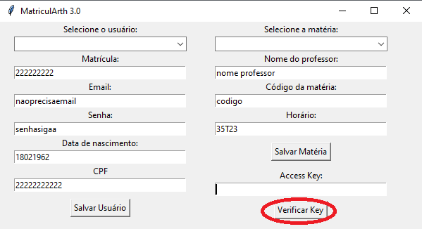
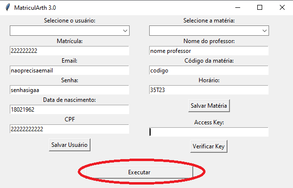

sherek


documentação gerada pelo gepeto, tenta entender aí

---

## TO-DO

- [ ] **Desmatricular automaticamente de uma matéria** quando uma vaga for aberta em outra de interesse (quando houver conflito de horários).
- [ ] **Substituir o uso do Selenium** por requisição direta à API do SIGAA para maior eficiência e desempenho (menor latência e mais rápido para pegar matéria).

---

# MatriculArth 3.0 - Bot de Matrícula SIGAA

**MatriculArth 3.0** é um bot desenvolvido para automatizar a matrícula em sistemas como o SIGAA, utilizando Python. Ele facilita o processo de matrícula de matérias, realizando a pesquisa por elas e preenchendo automaticamente os dados necessários.

## Funcionalidades

- **Alarme para matérias**: O bot pesquisa a matéria a cada 5 segundos.
- **Salvamento local em JSON**: O bot salva as informações do estudante e da matéria localmente, evitando o preenchimento repetido.
- **Verificação de Key**: Após inserir os dados, você pode clicar em "Verificar Key" (não é necessário fornecer uma "Access Key").
- **Execução da matrícula**: O bot executa a matrícula automaticamente após clicar em "Executar".
- **Múltiplas instâncias**: É possível abrir várias instâncias do programa, executando o comando `python MatriculArth.py`, para deixar o bot pegando diferentes matérias ao mesmo tempo.

## Requisitos

- Python 3.10
- Instalar as dependências com o comando:
  ```bash
  pip install -r requirements.txt
  ```

## Como Usar

1. **Clone o repositório**:
   ```bash
   git clone https://github.com/Arthrok/bot-matricula-sigaa
   cd bot-matricula-sigaa
   ```

2. **Instale as dependências**:
   ```bash
   pip install -r requirements.txt
   ```

3. **Execute o script**:
   ```bash
   python MatriculArth.py
   ```

4. **Preencha as informações do estudante e da matéria**:
   - Matricula
   - Email
   - Senha
   - Data de nascimento
   - CPF
   - Nome do professor
   - Código da matéria
   - Horário da matéria

5. **Salve as informações**:
   - Clique no botão "Salvar Usuário" para salvar as informações do estudante.
   - Clique em "Salvar Matéria" para salvar os dados da matéria. Isso armazenará as informações localmente em um arquivo JSON.

6. **Verifique a Key**:
   - Não é necessário fornecer uma "Access Key". Apenas clique no botão **Verificar Key**.

   

7. **Execute a matrícula**:
   - Após a verificação, clique em **Executar** para que o bot inicie a busca e matrícula automática da matéria.

   

---

## Funcionalidade do Bot

O bot vai pesquisar pela matéria a cada 5 segundos. Você pode modificar esse intervalo de tempo diretamente no código, se desejar.

## Sistema Operacional

O bot foi desenvolvido para funcionar de maneira ideal em **Windows**. Caso deseje utilizá-lo em **Linux** ou outros sistemas operacionais, pode ser necessário adaptar o código. Para usar no Linux, verifique se todas as dependências e drivers estão corretamente configurados.